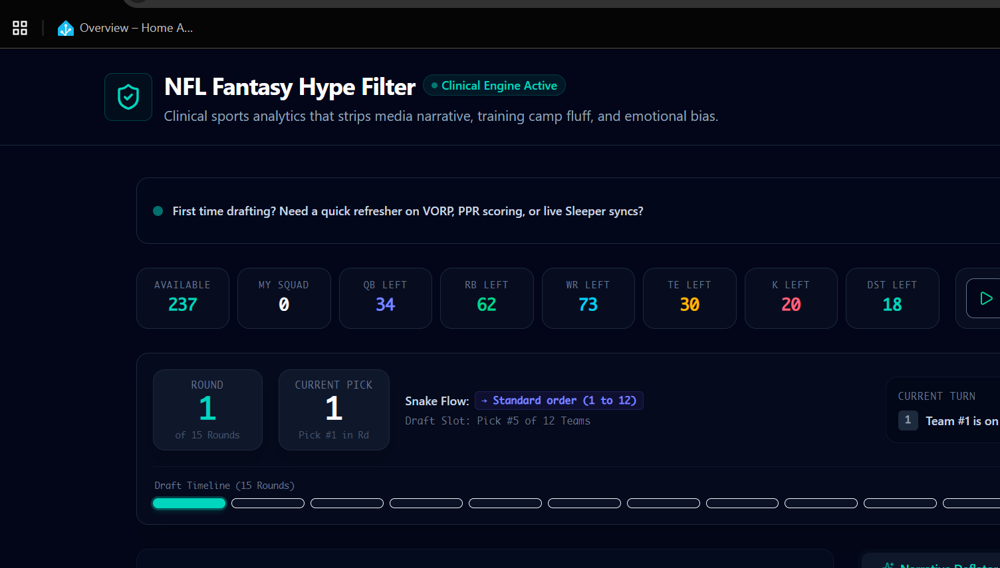

# FIRE

> A stats-first fantasy football draft assistant. The draft board, player pool, roster, and log all run on raw numbers — targets, routes, and baselines — not headlines or camp buzz.

**[Live demo →](https://fantasy-draft.crackerbox.app)**



## What it does

This is a live draft board synced to real Sleeper league data, with optional on-demand AI analysis for any player — regression risk, system fit, floor/ceiling range, and a stability score — all grounded in the underlying stats.

- **Live Sleeper sync** — pulls real draft, league, and public-ADP data straight from the Sleeper API
- **Snake draft board** with round/pick tracking, timer, and tiered player pool
- **AI analysis** on demand for any player: objective metrics, regression flags, system impact, and a 1–10 stability score
- **Custom scoring support** — standard, PPR, and half-PPR aware
- Draft log, squad tracking, and advanced filtering tools

## How the AI analysis works

Player breakdowns run on the AI assistant built into the app, using an API key you supply in Settings (saved only on this device, never sent to any server). You can bring your own key from any AI provider. Each request returns a structured JSON report (objective metrics, regression risk, system analysis, variance assessment) rendered directly in the player info panel.

## Tech stack

- React + TypeScript, Vite
- Cloudflare Pages Functions for the health/backend layer
- Sleeper API for live league/draft data
- Bring-your-own-key AI assistant for player analysis
- Deployed on Cloudflare Pages

## Project structure

```
src/                  React app source
functions/            Cloudflare Pages Functions (health endpoint)
```

## Local development

```bash
npm install
npm run dev
```

The AI assistant uses a key you paste in the app's Settings (bring-your-own-key) — no server-side key needed.

## Deployment

Auto-deploys to Cloudflare Pages on every push to `main`:

```
build command: npm run build
publish dir:   dist
functions dir: functions
```

---

Built by [Tim Graham](https://github.com/joecracker) — part of the [crackerbox.app](https://crackerbox.app) project family.
